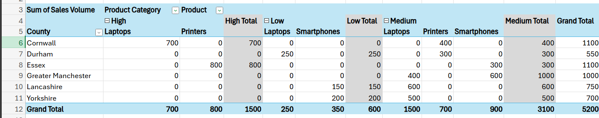
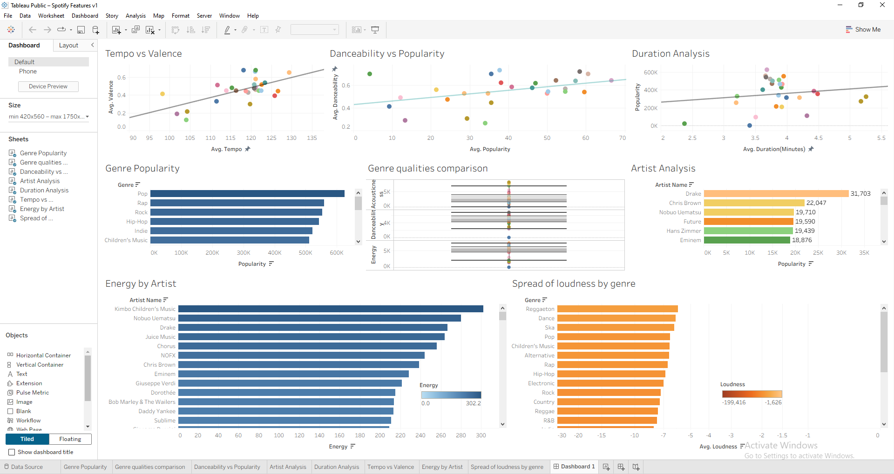
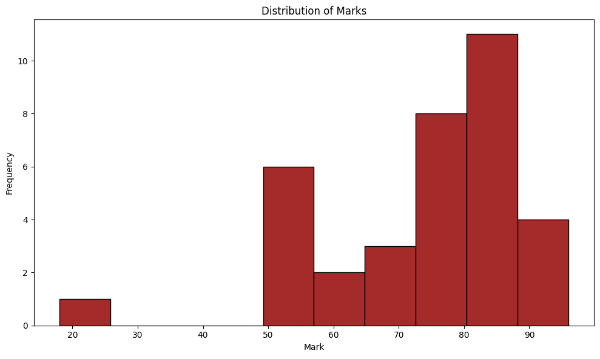
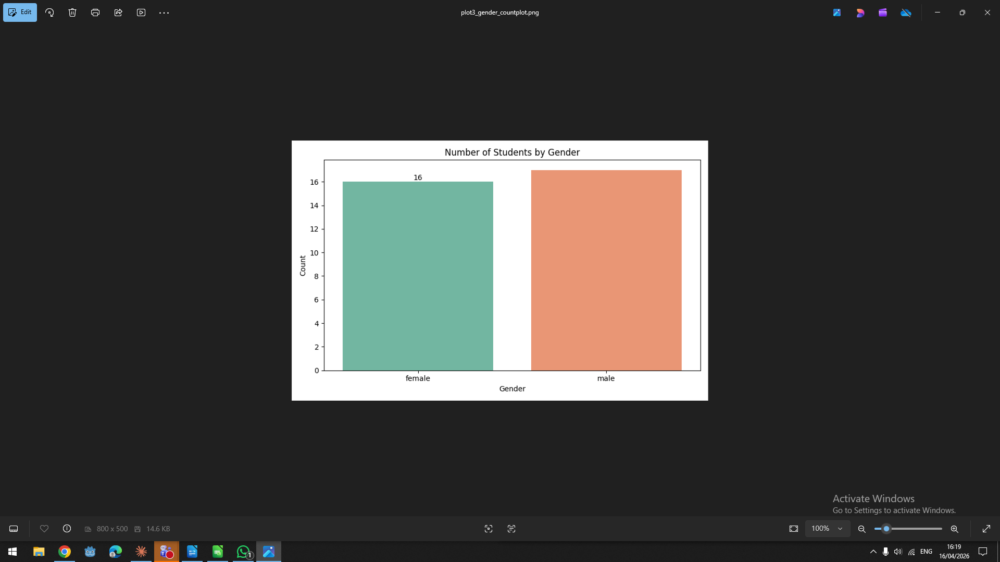
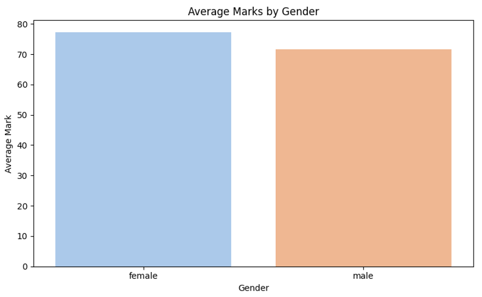
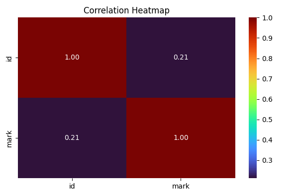
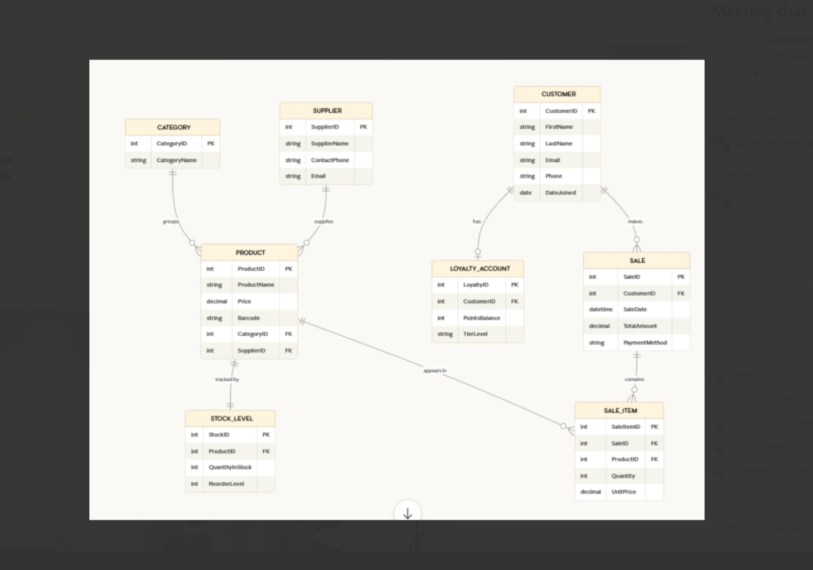
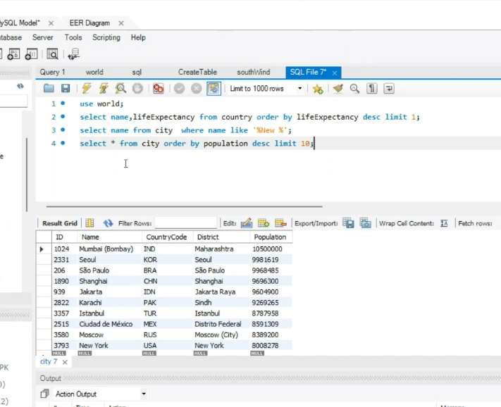
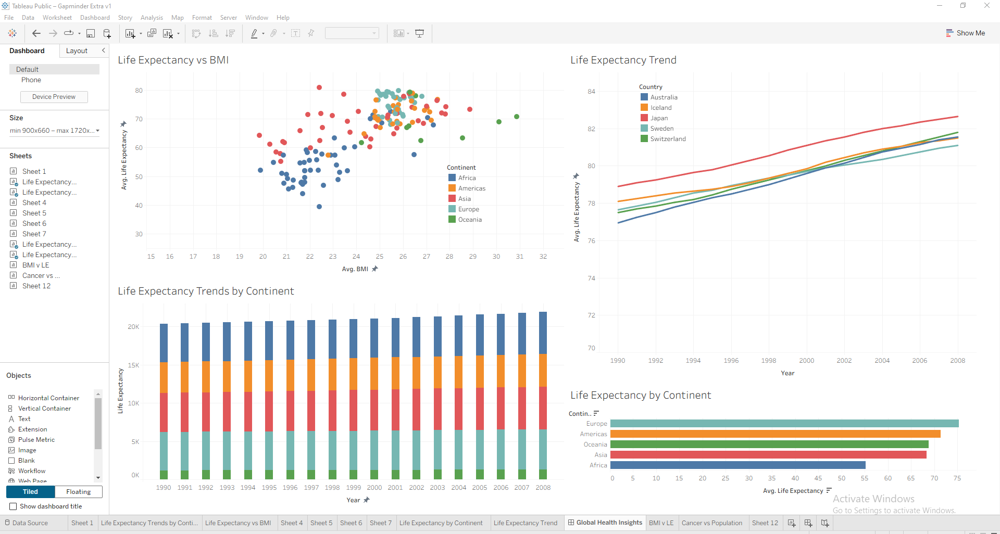
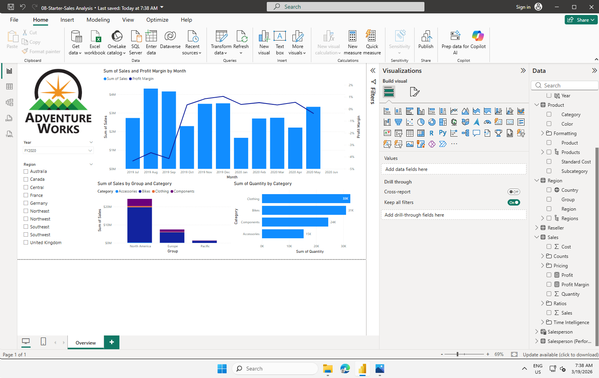

# Data-Analytics-Portfolio-Maxwell-Cox

# Hi, I'm Max

I'm a data technician in training who enjoys turning raw data into clear, actionable insights. I work across Excel, SQL, Python, Tableau, and Power BI and I'm focused on communicating findings in a way that makes sense to both technical and non-technical audiences.

## What I work on

I work with real-world datasets to answer business questions and spot trends. My projects span multiple tools and domains, each built around a genuine analytical question.
Core skills:
Excel SQL (MySQL) Python (Pandas, NumPy, Matplotlib, Seaborn) Tableau Power BI Data Cleaning Exploratory Analysis Dashboard Design ERD & Database Design

## Selected projects 

## County Product Sales Analysis | Excel

This dataset tracks the sales performance of products across several counties in England. 
The data was provided as a raw table with three columns — County, Product, and Sales Volume.

Before any analysis, the Sales Volume column needed cleaning as the values had trailing 
spaces that caused Excel to read them as text instead of numbers. Once fixed, I built a 
pivot table to summarise total sales by county and product, then added a SWITCH formula 
to automatically label each row as High, Medium, or Low based on sales volume thresholds. 
Conditional formatting was applied on top to make the performance bands immediately visible.

**Formula used:**
```excel
=SWITCH(TRUE, C2 > 600, "High", C2 >= 300, "Medium", "Low")
```



## Spotify Music Features Analysis | Tableau

**Live Dashboard:** [View on Tableau Public](https://public.tableau.com/app/profile/maxwell.cox/viz/SpotifyFeaturesv1_17737560541200/Dashboard1?publish=yes)  
**Tool:** Tableau Public  
**Skills Demonstrated:** Data import, multi-sheet dashboard design, scatter 
plots, bar charts, box plots, trend lines, filtering

This project analyses a Spotify features dataset covering thousands of tracks 
across multiple genres. Each track includes audio attributes measured by 
Spotify's algorithm — including danceability, energy, tempo, valence, loudness, 
speechiness, and popularity. The goal was to find patterns in what makes music 
popular and how genres differ in their audio characteristics.

Eight worksheets were built and combined into a single dashboard covering:

- Tempo vs Valence — exploring whether faster songs tend to sound more positive
- Danceability vs Popularity — testing whether danceability drives stream counts
- Duration Analysis — checking if song length has any relationship to popularity
- Genre Popularity — ranking genres by total popularity score
- Genre Qualities Comparison — comparing acousticness and energy across genres using a box plot
- Artist Analysis — identifying the highest popularity artists in the dataset
- Energy by Artist — ranking artists by average track energy
- Spread of Loudness by Genre — comparing how loud different genres are on average

Key findings included Pop dominating genre popularity by a significant margin, 
Drake leading artist popularity with 31,703 points, and Reggaeton, Dance, and 
Ska being the loudest genres — a counterintuitive result given Rock's reputation 
for high volume. Song duration showed almost no relationship with popularity, 
suggesting listeners care about quality over length.




## Student Performance Analysis | Python & Pandas

**Tools:** Python, Pandas, NumPy, Matplotlib, Seaborn  
**Environment:** Jupyter Notebook  
**Skills Demonstrated:** Data loading, exploration, cleaning, manipulation, 
aggregation, conditional logic, pivot tables, visualisation, exporting

This project analyses a student dataset using Python and Pandas, covering 
the full data analysis workflow from raw CSV to cleaned, enriched output 
with visualisations.

The dataset contains student names, class, gender, and marks. After loading 
the data and exploring its structure with `.head()`, `.info()`, and 
`.describe()`, the following steps were carried out:

- Added a `passed` column using a boolean condition (`mark >= 60`)
- Renamed columns and dropped temporary fields to keep the data clean
- Grouped by class and gender to calculate mean scores using `groupby()`
- Built a pivot table showing average mark by class and gender
- Used `np.select()` to assign letter grades: A (85+), B (70-84), C (60-69), D (below 60)
- Sorted the DataFrame by score in descending order
- Exported the final enriched dataset to a new CSV file

Four visualisations were produced using Matplotlib and Seaborn:

**Distribution of Marks**


**Number of Students by Gender**


**Average Marks by Gender**


**Correlation Heatmap**



## World Database SQL Analysis | MySQL

**Tools:** MySQL Workbench, SQL  
**Skills Demonstrated:** Database design, ERD creation, SELECT queries, filtering, 
sorting, aggregation, pattern matching

This project covers two connected areas — designing a relational database schema 
for a retail business, and writing SQL queries against a real-world dataset.

**Database Design**

The first part involved designing a star schema for a small corner shop with a loyalty 
programme. The schema was built around a central Sales fact table with dimension tables 
for Customers, Products, Categories, Suppliers, Stock Level, Loyalty Accounts, and Sale 
Items. Relationships between tables were defined using primary and foreign keys, and the 
full schema was mapped out as an Entity Relationship Diagram (ERD).



**SQL Querying**

The second part involved querying the World database in MySQL Workbench across a range 
of real-world business scenarios. Queries covered finding the country with the highest 
life expectancy, identifying cities by population thresholds, filtering city names using 
pattern matching, sorting results, and using aggregate functions to compare populations 
across countries.



**Example queries written:**
```sql
-- Country with highest life expectancy
SELECT name, lifeExpectancy FROM country 
ORDER BY lifeExpectancy DESC LIMIT 1;

-- Cities with population over 2 million
SELECT name, population FROM city 
WHERE population > 2000000;

-- Cities starting with 'Be'
SELECT name FROM city WHERE name LIKE 'Be%';

-- Top 10 most populated cities
SELECT * FROM city ORDER BY population DESC LIMIT 10;
```


**Power BI Dashboards**


## Global Health Insights Dashboard | Tableau

**Live Dashboard:** [View on Tableau Public](https://public.tableau.com/app/profile/maxwell.cox/viz/GapminderDashboard_17745208717160/GlobalHealthInsights?publish=yes)

This project analyses the GapminderHealth dataset covering global health metrics across 
countries and continents from 1990 to 2008. The goal was to identify health trends and 
disparities that a global health organisation could use to inform future decisions.

The dataset contains 6,000 records with fields including life expectancy, BMI, population, 
gender, country, and continent. Using Tableau, I built four individual worksheets and 
combined them into a single interactive dashboard covering life expectancy by continent, 
life expectancy trends over time for the top 5 countries, population distribution by gender, 
and a scatter plot comparing average BMI against life expectancy coloured by continent.

Key findings included a clear positive relationship between BMI and life expectancy, with 
European and Oceanian nations clustering at the higher end while African countries sat 
significantly lower. Japan led life expectancy among the top 5 countries, reaching roughly 
83 years by 2008, and Europe averaged around 75 years compared to Africa at approximately 
55, highlighting a persistent global health inequality.




## AdventureWorks Sales Analysis | Power BI

**Tool:** Microsoft Power BI Desktop  
**Skills Demonstrated:** Data import, report design, multi-page layout, 
slicers, combo charts, bar charts, KPI cards

This report was built using the AdventureWorks dataset, a widely recognised 
sample sales dataset covering orders, products, regions, and profit across 
multiple financial years.

The report spans three pages — Overview, Profit, and My Performance. The 
Overview page (shown below) combines a dual-axis combo chart tracking Sales 
and Profit Margin by month, a grouped bar chart breaking down Sales by Product 
Group and Category across regions, and a horizontal bar chart showing total 
Quantity sold per Category. Year and Region slicers were added to allow 
interactive filtering across all visuals.

The Profit page uses a matrix table to summarise Orders, Sales, Cost, Profit, 
and Profit Margin by financial year, with a Region slicer for cross-filtering. 
The My Performance page compares actual Sales against Targets with Variance 
and Variance Margin KPI cards at the top, giving a clear at-a-glance view of 
performance gaps. The completed report was published to Power BI Service.



## Get in touch

I'm currently looking for opportunities in data analysis and am open to entry-level roles, internships, or project collaborations.

GitHub: github.com/mjc-237
LinkedIn: https://www.linkedin.com/in/maxwell-cox/
Email: maxcox2@gmail.com
